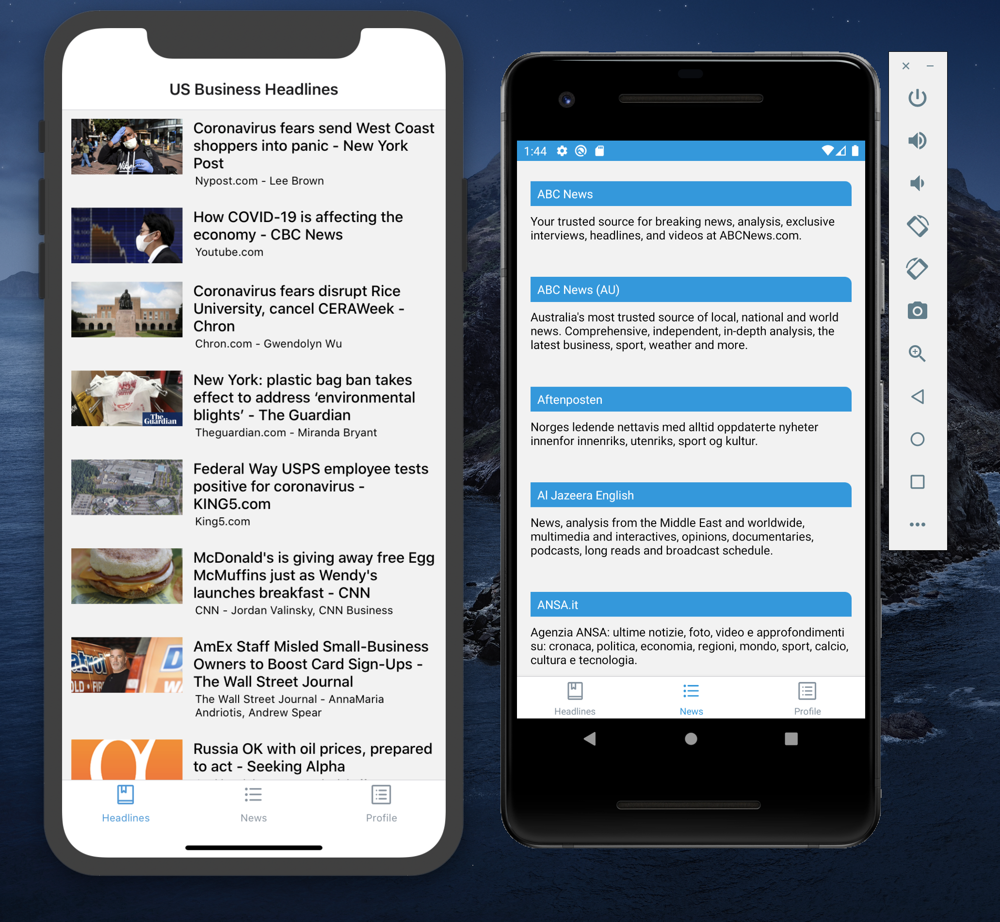

# react-native-sample-app

News-App-Sample



## Install and run on android

```
git clone https://github.com/Sherange/News-A.git
cd News-A
yarn install
react-native run-android
```

## Install and run on ios

```
git clone https://github.com/Sherange/News-A.git
cd News-A
cd ios && pod install
yarn install
react-native run-ios
```
